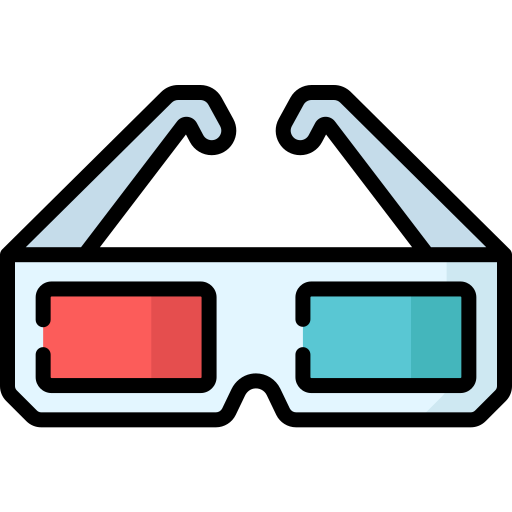
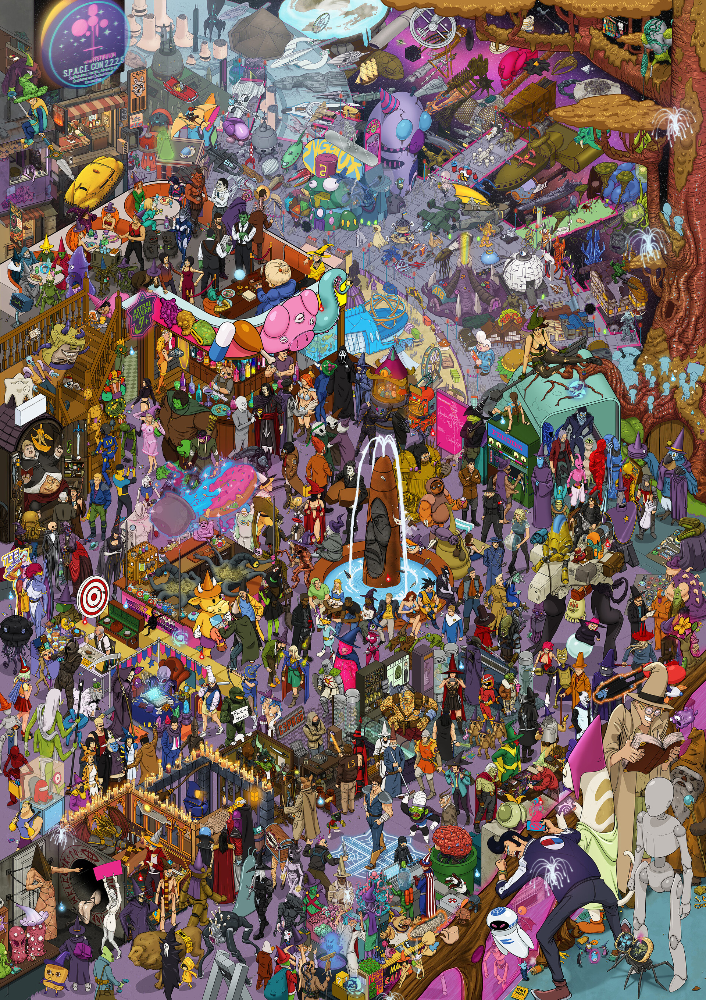
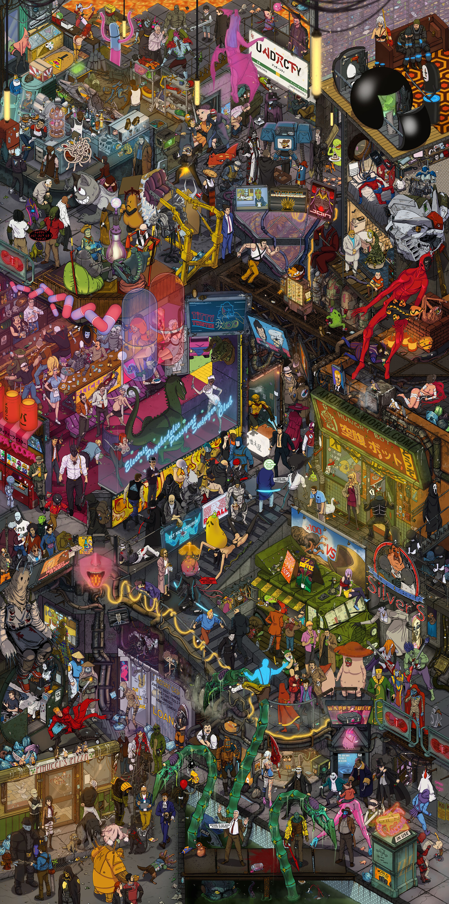
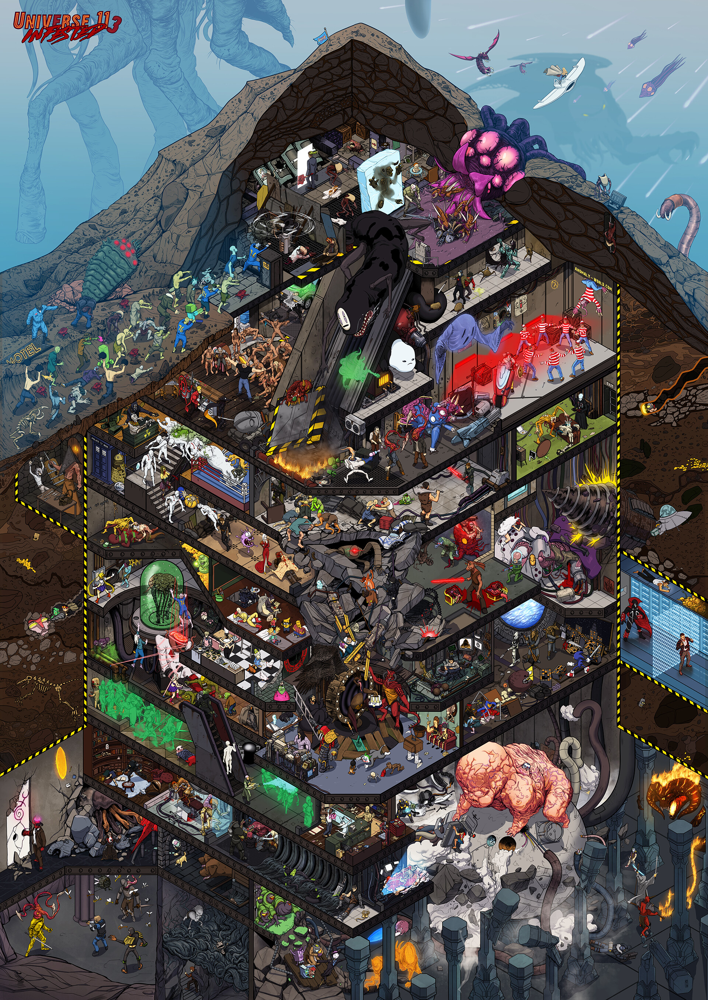

# BILDER

  
  <h1>BILDER</h1>

  

Table of Contents

<ol>
  <li>
    <a href="#introduction">Introduction</a>
    <ul>
      <li>
        <a href="#api">API</a>
      </li>
    </ul>
  </li>
  <li>
    <a href="#features">Features</a>
    <ul>
      <li>
        <a href="#built-with">Built With</a>
      </li>
    </ul>
  </li>
  <li><a href="#preview">Preview</a></li>
  <li><a href="#contributing">Contributing</a></li>
  <li><a href="#license">License</a></li>
</ol>

## Introduction
BILDER is a full-stack browser game inspired by classic "Where's Waldo?" puzzles. Players explore large, detailed scenes and race against the clock to locate randomly selected characters hidden throughout each map.

This repository contains the client-side application.

## Server
The client communicates with a separate RESTful API built with Express, Prisma, and PostgreSQL.
- Backend Repository: https://github.com/Dewiin/wimmelbilder-api

## Features
- 🎯 Interactive Character Search Gameplay
    - Search large illustrated maps to locate hidden characters.
- 💾 Persistent Session Recovery
    - Resume active games after refreshing the page.
    - Restore previously found characters and session progress.
    - Prevent accidental loss of progress during gameplay.
- 🏆 Scoring & Completion Tracking
    - Track completion time for each game session.
    - Automatically calculate scores when a session ends.
    - Foundation for leaderboard and ranking systems.
-⚡ Responsive User Experience
    - Smooth animations powered by Motion.
    - Toast notifications provide real-time gameplay feedback.
    - Optimized interface for desktop and mobile devices.

### Built With

[![React][React]][React-url]
[![React-router][React-router]][React-router-url]
[![React-hook-form][React-hook-form]][React-hook-form-url]
[![Vite][Vite]][Vite-url]
[![Shadcn][Shadcn]][Shadcn-url]
[![Tailwind][Tailwind]][Tailwind-url]

<a href="#readme-top">Back to top</a>

## Preview

### SPACECON

### UNDRCTY

### UNIVERSE11

<a href="#readme-top">Back to top</a>

## Contributing

I like open-source and want to develop practical applications for real-world problems. However, individual strength is limited. So, any kinds of contribution is welcome, such as:

- New features
- Bug fixes
- Typo fixes
- Suggestions
- Maintenance
- Documents
- etc.

#### Heres how you can contribute:

1. Fork the repository
2. Create a new feature branch
3. Commit your changes
4. Push to the branch
5. Submit a pull request

<a href="#readme-top">Back to top</a>

## License

MIT License

Copyright (c) 2026 Devin

Permission is hereby granted, free of charge, to any person obtaining a copy
of this software and associated documentation files (the "Software"), to deal
in the Software without restriction, including without limitation the rights
to use, copy, modify, merge, publish, distribute, sublicense, and/or sell
copies of the Software, and to permit persons to whom the Software is
furnished to do so, subject to the following conditions:

The above copyright notice and this permission notice shall be included in all
copies or substantial portions of the Software.

THE SOFTWARE IS PROVIDED "AS IS", WITHOUT WARRANTY OF ANY KIND, EXPRESS OR
IMPLIED, INCLUDING BUT NOT LIMITED TO THE WARRANTIES OF MERCHANTABILITY,
FITNESS FOR A PARTICULAR PURPOSE AND NONINFRINGEMENT. IN NO EVENT SHALL THE
AUTHORS OR COPYRIGHT HOLDERS BE LIABLE FOR ANY CLAIM, DAMAGES OR OTHER
LIABILITY, WHETHER IN AN ACTION OF CONTRACT, TORT OR OTHERWISE, ARISING FROM,
OUT OF OR IN CONNECTION WITH THE SOFTWARE OR THE USE OR OTHER DEALINGS IN THE
SOFTWARE.

[React]: https://img.shields.io/badge/React-%2320232a.svg?style=for-the-badge&logo=react&logoColor=%2361DAFB
[React-url]: https://react.dev/

[React-router]: https://img.shields.io/badge/React_Router-CA4245?style=for-the-badge&logo=react-router&logoColor=white
[React-router-url]: https://reactrouter.com/

[React-hook-form]: https://img.shields.io/badge/React%20Hook%20Form-EC5990?style=for-the-badge&logo=reacthookform&logoColor=fff
[React-hook-form-url]: https://react-hook-form.com/

[Vite]: https://img.shields.io/badge/Vite-646CFF?style=for-the-badge&logo=vite&logoColor=fff
[Vite-url]: https://vite.dev/

[Shadcn]: https://img.shields.io/badge/shadcn%2Fui-000?style=for-the-badge&logo=shadcnui&logoColor=fff
[Shadcn-url]: https://ui.shadcn.com/

[Tailwind]: https://img.shields.io/badge/tailwindcss-%2323B2AC?style=for-the-badge&logo=tailwind-css&logoColor=white
[Tailwind-url]: https://tailwindcss.com/